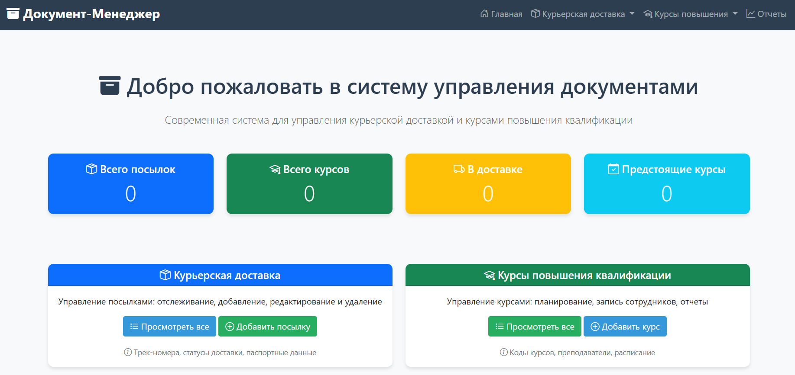
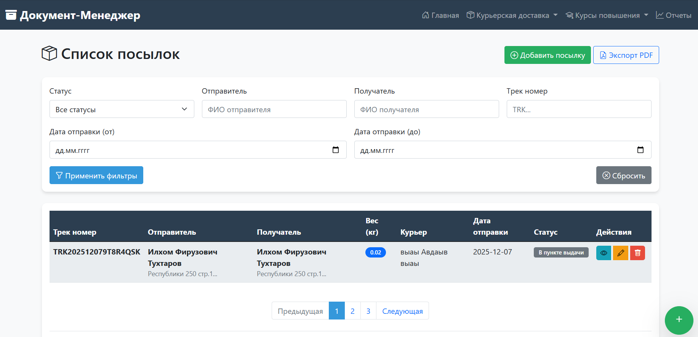
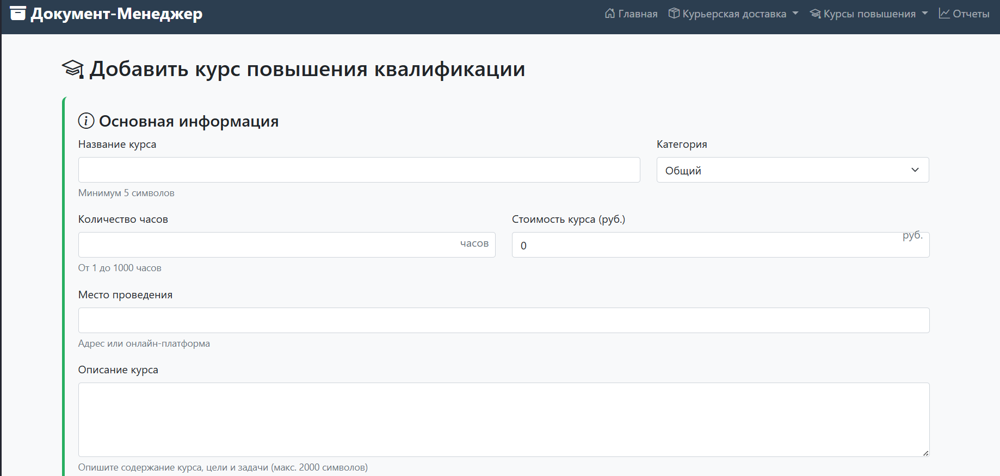
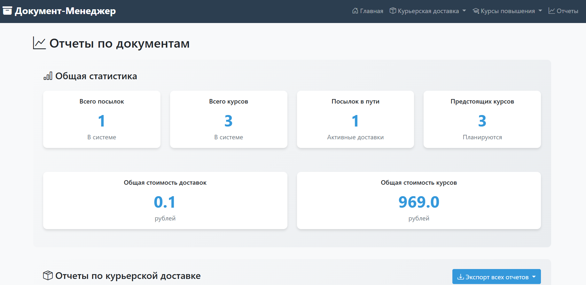

## 📸 Демонстрация

### Главная страница


### Список посылок


### Добавление курса


### Отчеты


# 📦🎓 Система управления документами на Flask + MongoDB

Система для управления курьерской доставкой и курсами повышения квалификации с полным CRUD функционалом, валидацией данных и генерацией отчетов.

## ✨ Особенности

### 📦 Курьерская доставка
- Управление посылками с трек-номерами
- Паспортные данные отправителя и получателя (серия, номер, дата рождения, пол)
- Строгая валидация всех полей
- Отслеживание статусов доставки
- Расчет стоимости доставки

### 🎓 Курсы повышения квалификации
- Управление курсами с уникальными кодами
- Информация о преподавателях
- Запись сотрудников (до 3 человек)
- Расписание и дедлайны регистрации
- Категории курсов

### 📊 Отчеты и аналитика
- Детальные отчеты по всем типам документов
- Экспорт в PDF и DOCX форматах
- Статистика и графики
- Фильтрация данных

## 🚀 Быстрый старт

### Предварительные требования
- Python 3.8+
- MongoDB
- Git

### Установка

1. **Клонируйте репозиторий:**
```bash
git clone https://github.com/yourusername/flask-mongodb-system.git
cd flask-mongodb-system

flask-mongodb-system/
├── app.py                 # Основное приложение Flask
├── requirements.txt       # Зависимости Python
├── validation.py         # Валидация данных
├── export.py            # Экспорт в PDF/DOCX
├── reports.py           # Генерация отчетов
├── .gitignore           # Игнорируемые файлы Git
├── README.md            # Документация
└── templates/           # HTML шаблоны
    ├── base.html
    ├── index.html
    ├── courier_list.html
    ├── courier_form.html
    ├── courses_list.html
    ├── courses_form.html
    ├── reports.html
    ├── courier_view.html
    ├── course_view.html
    ├── 404.html
    └── 500.html

    🔧 Технологии
Backend: Flask, PyMongo

Frontend: Bootstrap 5, JavaScript

База данных: MongoDB

Экспорт отчетов: ReportLab (PDF), python-docx (DOCX)

Валидация: Кастомная система валидации

📋 Функционал
CRUD операции
✅ Создание документов

✅ Чтение/просмотр

✅ Обновление/редактирование

✅ Удаление документов

Валидация данных
✅ Паспортные данные (серия, номер, дата рождения, пол)

✅ Телефоны (российский формат)

✅ Email адреса

✅ Даты (проверка логики)

✅ Числовые значения (вес, габариты, стоимость)

Отчеты
✅ Тяжелые посылки (>5 кг)

✅ Посылки в пути

✅ Посылки за неделю

✅ Статистика по курьерам

✅ Предстоящие курсы

✅ Длительные курсы (>40 часов)

✅ Курсы с полными группами

✅ Статистика по отделам